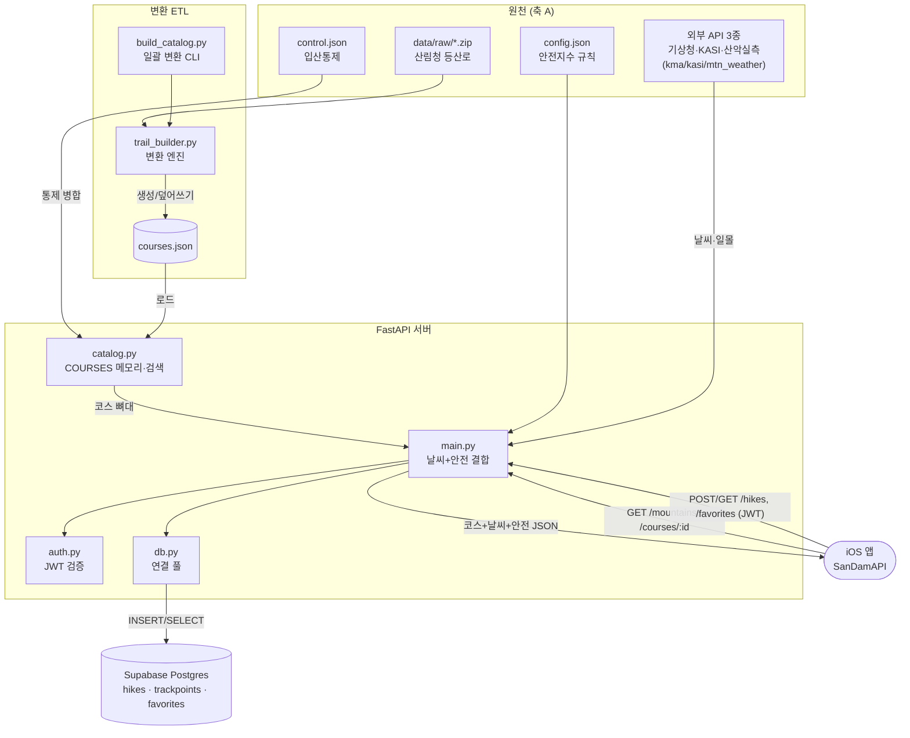

# 산담(SanDam) 서버

안전 중심 등산 앱 산담의 백엔드. **FastAPI**로 공공데이터(기상청·천문연·산악기상)를 중계하고,
안전지수·일몰·하산 데드라인을 연산하며, Supabase에 사용자 산행 기록을 저장합니다.

## 아키텍처

서버는 **두 개의 데이터 축**으로 나뉩니다.

- **축 A — 코스/환경 (읽기 전용):** 산림청 등산로 원본을 변환해 만든 코스에, 요청 시점의 날씨·일몰·안전지수를 얹어 앱에 내려줍니다. DB를 쓰지 않습니다(JSON + 메모리).
- **축 B — 사용자 데이터 (쓰기):** 앱이 올린 산행 기록·즐겨찾기를 JWT 인증 후 Supabase Postgres에 저장·조회합니다.

`main.py`(FastAPI)가 두 축의 중심이고, DB가 죽어도 축 A(검색·날씨)는 정상 동작하도록 분리돼 있습니다.



### 파일별 역할

| 파일 | 한 줄 역할 | 축 |
|---|---|---|
| `trail_builder.py` | 산림청 등산로(zip) → 코스 dict 변환 **엔진**. 핵심 키가 전 시스템 스키마 | A |
| `tools/build_catalog.py` | 엔진을 불러 코스를 **일괄 변환**하는 CLI + 산정보 API로 높이 보정 | A |
| `catalog.py` | `courses.json`을 메모리(`COURSES`)에 적재·검색, 없으면 즉석 변환 | A |
| `main.py` | 코스에 **날씨·일몰·안전지수를 요청 시점에 얹어** JSON 응답 (FastAPI) | A+B |
| `kma_weather.py` | 기상청 단기예보 수집 (없으면 목업 폴백) | A |
| `kasi_sunset.py` | 천문연(KASI) 일출몰 수집 (없으면 NOAA 자체 연산) | A |
| `mtn_weather.py` | 산악기상관측망 실측 수집 (관측소 10km 이내일 때) | A |
| `geo.py` | 공용 거리 계산(하버사인) | A |
| `auth.py` | Supabase JWT **검증**만(발급은 Supabase) → `user_id` 반환 | B |
| `db.py` | asyncpg 연결 풀(min1/max5), 축 B 전용 | B |
| `schema.sql` | DB 테이블 정의(`hikes`/`trackpoints`/`favorites`) + RLS | B |
| `config.json` | 안전지수 가중치·임계값·날씨 규칙 (코드 밖 튜닝값) | A |

## 환경변수 (`.env.example` 참고)

| 변수 | 용도 | 없을 때 |
|---|---|---|
| `DATA_GO_KR_SERVICE_KEY` | **공공데이터포털 공통키** — 기상청 단기예보 + 천문연 일출일몰 + 산악기상 실측 전부 이 키 하나로 동작 (Decoding 키 사용) | 목업 날씨 + NOAA 자체 일몰 연산 |
| `SUPABASE_JWT_SECRET` | 로그인 토큰 검증 | 기록/즐겨찾기 API만 503 |
| `DATABASE_URL` | Supabase Postgres 접속 | 기록/즐겨찾기 API만 503 |

> 키가 하나도 없어도 검색·날씨(목업)·일몰·안전지수 등 **공개 엔드포인트는 정상 동작**합니다.

## 데이터 파이프라인

```
data/raw/산명_산코드.zip   ← 산림청 등산로 (ESRI JSON, EPSG:5186)
  ↓  python tools/build_catalog.py        (pyproj 필요)
data/courses.json + data/mountains.json   ← catalog.py가 자동 로드
                                             (없으면 빈 카탈로그 → 검색 시 즉석 변환으로 채움)
data/control.json                          ← 입산통제 시즌 공고 수동 반영 → 해당 코스 danger 강제
data/mtweather_stations.json               ← 산악기상관측소 454곳 (커밋됨)
```

- 변환할 산 검색: `python tools/build_catalog.py --list 설악`
- **검수 필수:** 변환 후 앱 지도에서 경로가 실제 등산로 위에 그려지는지 확인.
- 통제정보 출처: 국립공원공단 knps.or.kr / 산림청 (시즌마다 갱신).

## 로컬 실행

```bash
pip install -r requirements.txt
cp .env.example .env        # 값 채우기(선택)
uvicorn main:app --reload --port 8000
# 문서: http://localhost:8000/docs
```

## 엔드포인트

| 메서드·경로 | 설명 | 로그인 |
|---|---|---|
| `GET /` | 헬스체크 | — |
| `GET /mountains?query=&lat=&lon=` | 코스 검색/근처 | — |
| `GET /courses/{id}` | 코스 상세(날씨·안전지수·일몰) | — |
| `GET /weather?lat=&lon=&summitAltitude=` | 해석형 날씨 | — |
| `GET /sunset?lat=&lon=&date=` | 일출/일몰 | — |
| `GET /safety/config` | 안전지수 튜닝값 | — |
| `POST /hikes` | 산행 기록 업로드 | ✅ |
| `GET /hikes` | 내 기록 목록 | ✅ |
| `GET/POST /favorites`, `DELETE /favorites/{id}` | 즐겨찾기 동기화 | ✅ |

## 배포 (Railway + Supabase)

### 1) Supabase
1. supabase.com에서 프로젝트 생성.
2. SQL Editor에 `schema.sql` 붙여넣고 실행(테이블 생성).
3. Authentication > Providers에서 **Apple** 활성화(서비스 ID·키 입력 — Apple Developer 필요).
4. `Settings > API`의 **JWT Secret** → `SUPABASE_JWT_SECRET`.
5. `Settings > Database`의 **Connection string(URI)** → `DATABASE_URL`.

### 2) Railway
1. railway.app에서 New Project → Deploy from GitHub repo(이 `hiking-server` 폴더).
2. `railway.json`이 있어 빌드/시작은 자동(`uvicorn main:app`).
3. Variables 탭에 `DATA_GO_KR_SERVICE_KEY`, `SUPABASE_JWT_SECRET`, `DATABASE_URL` 입력.
4. 배포되면 발급된 **https 도메인**을 앱 `SanDamAPI.baseURL`(prod)에 넣기.

### 3) 공공데이터 키
공공데이터포털(data.go.kr)에서 '기상청_단기예보 조회서비스' 활용신청 → 서비스키(Decoding)를 `DATA_GO_KR_SERVICE_KEY`에. 같은 키로 천문연 일출몰·산악기상 실측도 동작합니다.
